<div align="center">

# 🛡️ SafeSignal

### The 100% On-Device, Air-Gapped Cyber Defense Suite for Android
**Client-Side Scam Detection • Biometric Hardware Vault (AES-256) • Rapid 1930 Incident Response**

[](https://flutter.dev)
[](https://dart.dev)
[](https://safesignal-dx8.pages.dev)
[](https://safesignal-dx8.pages.dev)
[](https://github.com/UmarFarooqueJi/SafeSignal)
[](https://github.com/UmarFarooqueJi/SafeSignal)
[](LICENSE)
[](https://github.com/UmarFarooqueJi/SafeSignal)
[](https://cybercrime.gov.in)
[](https://github.com/UmarFarooqueJi)

<p align="center">
  🌐 <b>Official Live Web Portal:</b> <a href="https://safesignal-dx8.pages.dev"><b>safesignal-dx8.pages.dev</b></a>
</p>

<p align="center">
  <b>SafeSignal</b> is an ultra-private, client-side mobile security suite engineered to defend citizens against financial fraud, digital arrest scams, predatory loan spyware, and phishing threats — <b>operating 100% locally with zero cloud dependencies, zero external telemetry, and zero third-party API keys required.</b>
</p>

</div>

<br>

---

## 📱 Interactive Feature Showcase

<div align="center">

### 🌟 Core Dashboard & Command Center
| Threat Command Center | Intelligence Drawer & Tools |
| :---: | :---: |
| 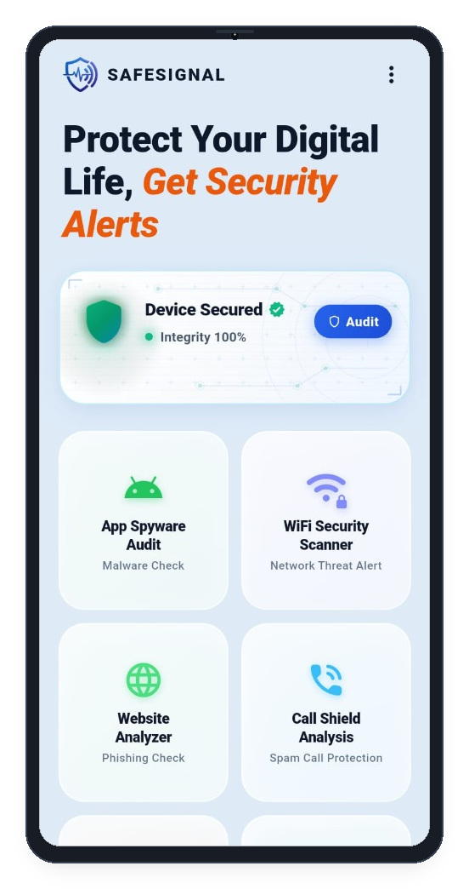 | 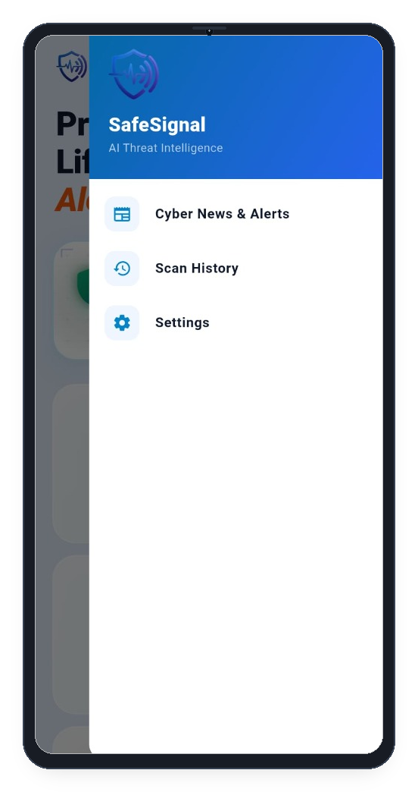 |
| **Real-Time Threat Score & Protection Status** | **Instant Access to Cyber Feed, History & Vault** |

<br>

### 📱 Deep Device & OS Security Audit
| Exploit & Hardware Diagnostics | Sensor Privacy & Hardware Specs | App Spyware & Risk Rating |
| :---: | :---: | :---: |
| 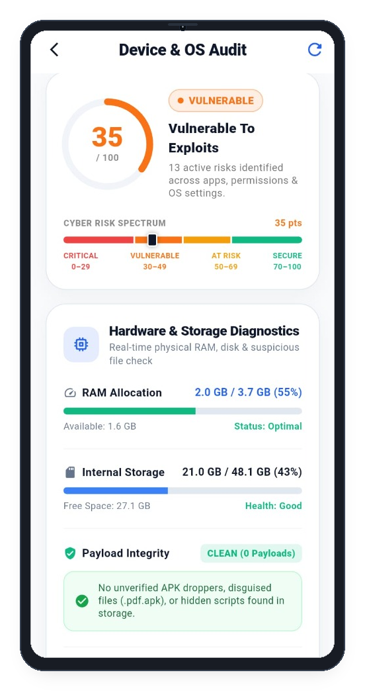 | 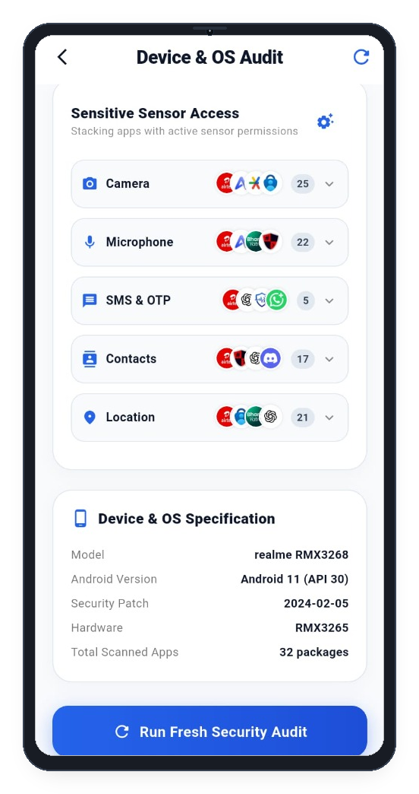 | 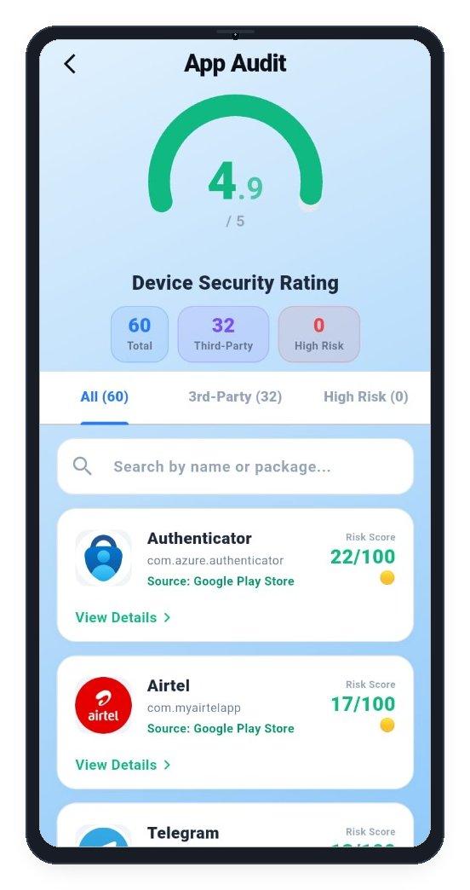 |
| **35/100 Exploit Risk & RAM/Disk Health** | **Camera/Mic Stacking & System Specs** | **4.9/5 Safety Score & Permission Matrix** |

<br>

### 🛡️ Web, Identity & Threat Intelligence
| Phishing & URL Shield | Email & Data Breach Monitor | Live Cyber Scam Advisories |
| :---: | :---: | :---: |
| 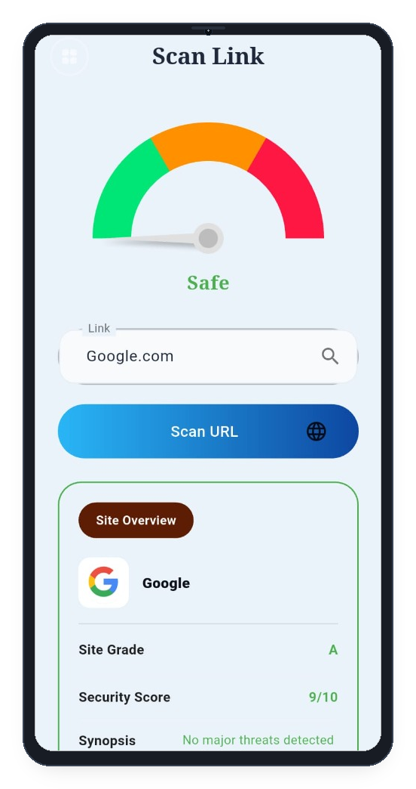 | 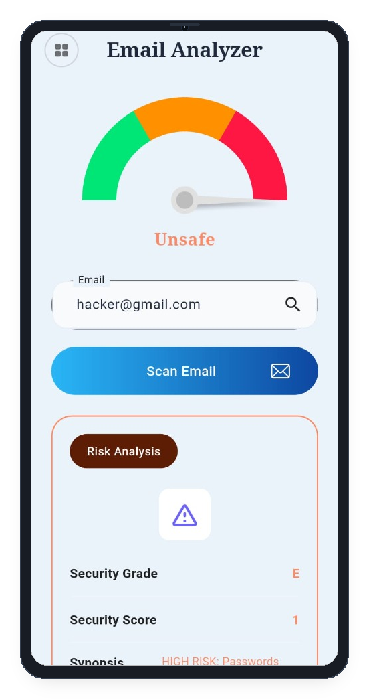 | 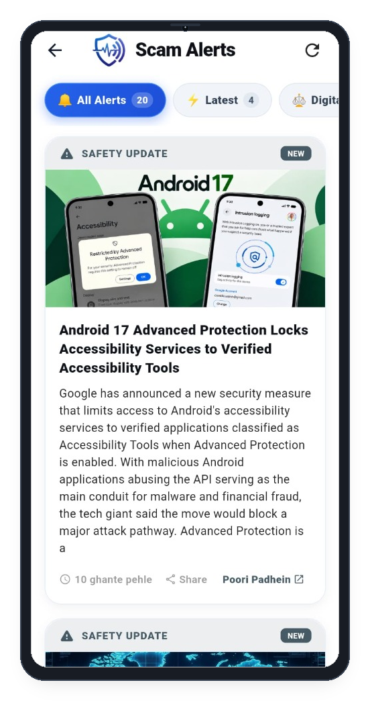 |
| **On-Device Phishing & Homograph Radar** | **Data Breach Exposure Verdict** | **Real-Time Fraud Alerts & Advisories** |

<br>

### 🚨 Rapid Incident Response & Live Defense
| Golden Hour & 1930 Helpline | Emergency Bank Freeze Directory | Legal FIR Complaint Generator |
| :---: | :---: | :---: |
| 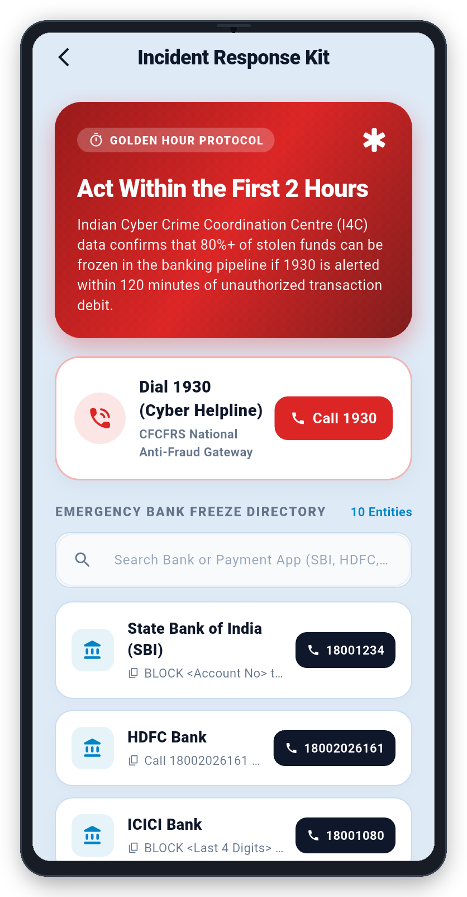 | 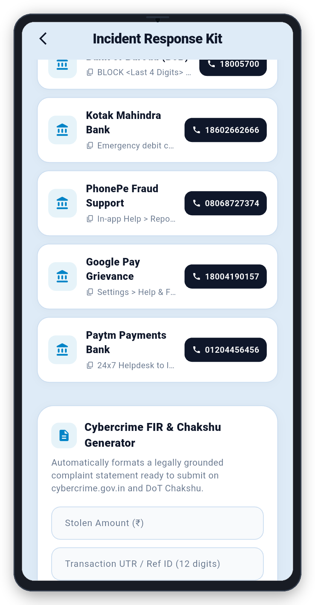 | 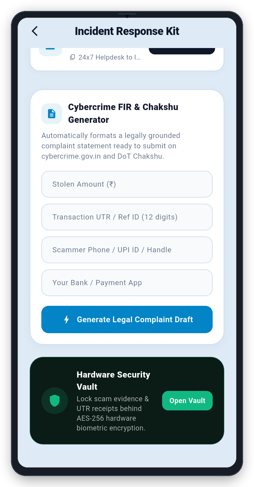 |
| **Direct Gateway to National 1930 Helpline** | **One-Touch Dial & Freeze for 10+ Banks** | **Automated Section 66D IT Act Legal Draft** |

<br>

### 🛡️ Live Threat Defense
| SMS Scam & Smishing Radar |
| :---: |
| 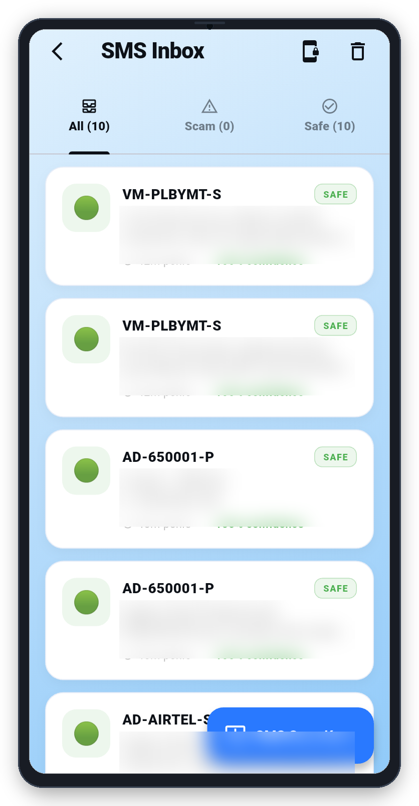 |
| **Real-Time SMS & OTP Theft Protection** |

</div>

<br>

---

## 🔒 The SafeSignal Privacy Manifesto

Most cybersecurity and antivirus apps today behave exactly like the spyware they claim to fight — uploading your installed apps, contacts, browser history, and scanned URLs to remote servers for data mining and ad targeting. 

**SafeSignal is built on an uncompromising privacy philosophy:**

1. **Zero Cloud Accounts**: No email registration, no phone verification, no passwords stored in third-party databases.
2. **Zero Telemetry**: Scanned URLs, SMS messages, private documents, and installed apps never leave your handset.
3. **Air-Gapped Operation**: Scanners run via on-device heuristics, Android `PackageManager` APIs, hardware keystore cryptography, and local offline signatures.
4. **Zero-Configuration Setup**: No `.env` files, no paid API keys (VirusTotal, Supabase, or OpenAI), and no rate limits. Clone, compile, and run.

---

## ⚡ Core Capabilities & Features

### 1. 🚨 Financial Fraud Incident Response & Golden Hour Defense
- **Direct National Helpline Integration**: Instant single-tap gateway to the Indian National Cyber Crime Reporting Portal (**1930 Toll-Free**).
- **Emergency Nodal Bank Freeze Directory**: One-touch direct dialers to nodal freeze helplines for SBI, HDFC, ICICI, Axis, PNB, Kotak, PhonePe, Paytm, Google Pay, and Airtel Payments Bank.
- **Automated Police FIR Draft Generator**: Generates formal, legally-structured cybercrime complaints under **Section 66D of the Information Technology Act, 2000**.
- **Golden Hour Protocol**: Step-by-step immediate containment checklist designed to stop unauthorized fund siphoning within the critical first two hours.

### 2. 🔐 Hardware-Backed Biometric Security Vault
- **AES-256-GCM Encryption**: Document files and identity records are encrypted locally using keys stored in the Android Hardware Keystore (Keymaster / StrongBox).
- **Biometric Authentication Gate**: Enforces hardware fingerprint or face unlock before vault decryption.
- **OCR Document Scanner**: On-device machine vision automatically extracts document metadata and renders safe in-vault previews without unencrypted caching.

### 3. 🔍 On-Device Phishing & Malicious URL Radar
- Deep heuristic inspection for **homograph/punycode attacks**, domain generation algorithms (DGA), TLD reputation entropy, and deceptive redirect chains.
- Identifies brand spoofing targeting major institutions (SBI, Google, Paytm, Netflix, Amazon) without leaking browsing history to cloud scanners.
- Verifies SSL/TLS certificate validity and security response headers directly from client sockets.

### 4. 📱 Deep Device Security Audit & Spyware Radar
- **Firmware & OS Integrity Check**: Detects root access, Magisk/SuperSU binaries, unlocked bootloaders, and unsafe developer/USB debugging modes.
- **Sensor Stacking Radar**: Audits installed applications against dangerous permission clusters (e.g., simultaneous `READ_SMS` + `RECORD_AUDIO` + `SYSTEM_ALERT_WINDOW`).
- **Sideload & Signature Detection**: Distinguishes verified platform packages from unverified third-party APK sideloads.

### 5. 🛡️ Real-Time SMS Scam & Smishing Defense
- Client-side heuristic parser detects TRAI DLT template anomalies, fake bank KYC threats, electricity bill disconnection scams, and OTP theft attempts.
- Completely offline analysis: your private communications are never transmitted to external servers.

### 6. 📰 Open Cyber Threat Feed
- Aggregates live public cyber safety alerts, scam warnings, and vulnerability advisories via open keyless RSS feeds (Google News India Cyber Crimes & The Hacker News).
- Fully cached for offline reading with bilingual support (English / Hindi).

---

## 🏗️ Architecture: Pure On-Device Defense

```
┌─────────────────────────────────────────────────────────────┐
│                    SafeSignal UI Layer                      │
│             Flutter 3.x • Material 3 • Riverpod             │
└──────────────────────────────┬──────────────────────────────┘
                               │
┌──────────────────────────────▼──────────────────────────────┐
│                  On-Device Security Engines                 │
│  ┌───────────────────────┐       ┌───────────────────────┐  │
│  │ Local Heuristic Radar │       │ Android OS Auditor    │  │
│  │ (Homograph/DGA/Entropy)│      │ (Root/Sensors/Perms)  │  │
│  └───────────────────────┘       └───────────────────────┘  │
│  ┌───────────────────────┐       ┌───────────────────────┐  │
│  │ Hardware KeyStore     │       │ Client-Side Smishing  │  │
│  │ (AES-256-GCM Vault)   │       │ (Offline Regex/NLP)   │  │
│  └───────────────────────┘       └───────────────────────┘  │
└──────────────────────────────┬──────────────────────────────┘
                               │
┌──────────────────────────────▼──────────────────────────────┐
│                     Local Storage Layer                     │
│        Hive Local DB • SharedPreferences • SecureStorage    │
└─────────────────────────────────────────────────────────────┘
```

---

## 🚀 Getting Started & Downloads

### 📥 Direct APK Download (No Build Required)
Get the pre-compiled, signed production release APK directly from our official portal:
- 🌐 **Web Portal:** [safesignal-dx8.pages.dev](https://safesignal-dx8.pages.dev)
- 📦 **Download Link:** [SafeSignal-v1.4.2-Universal.apk](https://safesignal-dx8.pages.dev)

---

### 🛠️ Building from Source

SafeSignal is designed for frictionless compilation with zero configuration hurdles.

### Prerequisites
- [Flutter SDK](https://docs.flutter.dev/get-started/install) (`>= 3.10.7`)
- Android Studio / VS Code with Flutter extension
- Android Device or Emulator (API level 26+)

### Instant Run (3 Commands)

```bash
# 1. Clone the repository
git clone https://github.com/UmarFarooqueJi/SafeSignal.git
cd SafeSignal/safesignal

# 2. Install dependencies
flutter pub get

# 3. Launch directly on device
flutter run
```

> [!NOTE]
> **No `.env` or external API keys needed.** All analysis pipelines, biometric vaults, OS diagnostics, and threat feeds operate out of the box with zero external configuration.

---

## 🤝 Contributing

Contributions are welcome! Please check [CONTRIBUTING.md](CONTRIBUTING.md) to learn about our coding standards, security requirements, and pull request workflow.

---

## 📄 License

SafeSignal is open-source software licensed under the **MIT License**. See the [LICENSE](LICENSE) file for complete details.

---

<div align="center">
  <sub>Engineered with precision by <b><a href="https://github.com/UmarFarooqueJi">Umar Farooque</a></b> for a safer, private digital society.</sub>
</div>
