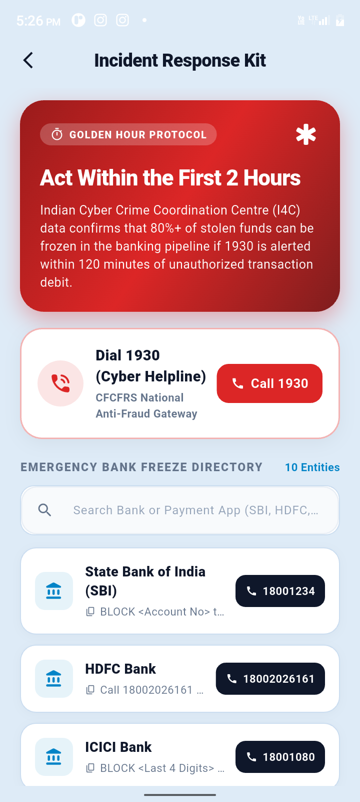
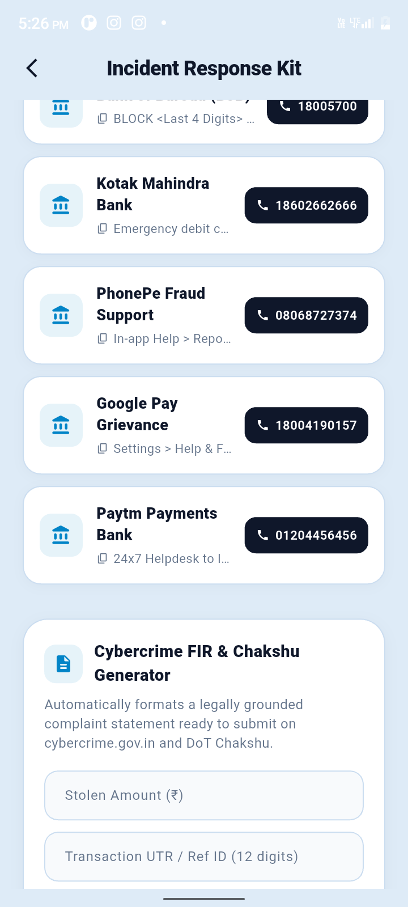
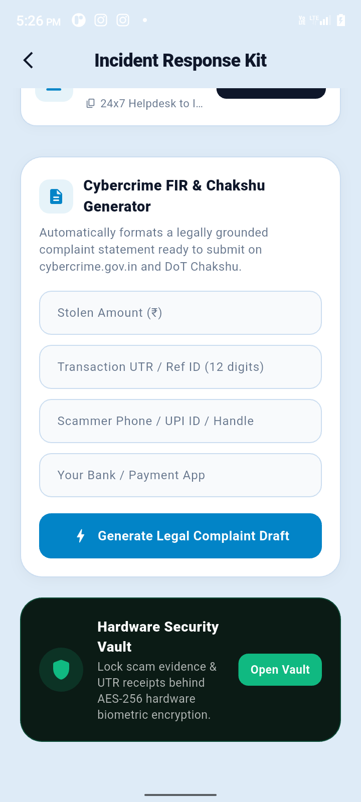
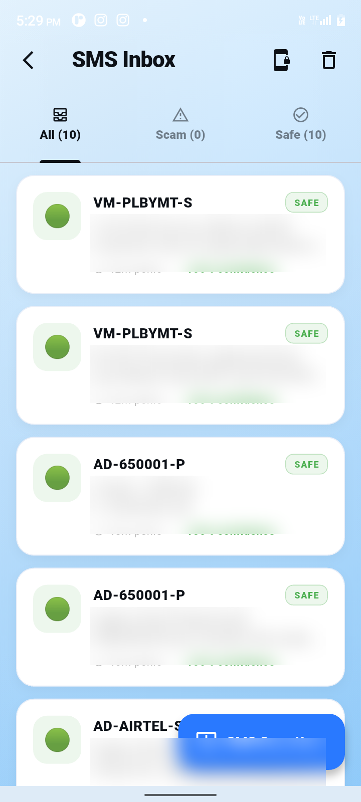

<div align="center">
  
  <h1>🛡️ SafeSignal</h1>
  <p><b>Next-Generation Open-Source AI Mobile Security & Anti-Fraud Suite for Android</b></p>

  [](https://flutter.dev)
  [](#)
  [](LICENSE)
  [](CONTRIBUTING.md)
  [-success?style=for-the-badge&logo=android&logoColor=white)](https://github.com/UmarFarooqueJi/SafeSignal/releases/latest)
  <br>
  <b>🚀 Powered by Hybrid AI Orchestration & Real-time Threat Intelligence</b>
</div>

<br>

---

## 📱 App Experience & Feature Showcase

<div align="center">

### 🌟 Core Dashboard & Experience
| Threat Command Center | Intelligence Drawer & Tools |
| :---: | :---: |
|  |  |
| **Real-Time Threat Score & Protection Status** | **Instant Access to Cyber Feed, History & Settings** |

<br>

### 📱 Deep Device & OS Security Audit
| Exploit & Hardware Diagnostics | Sensor Privacy & Hardware Specs | App Spyware & Risk Rating |
| :---: | :---: | :---: |
|  |  |  |
| **35/100 Exploit Risk & RAM/Disk Health** | **Camera/Mic Stacking & System Specs** | **4.9/5 Safety Score & App Risk Scoring** |

<br>

### 🛡️ Web, Identity & Threat Intelligence
| Phishing & URL Shield | Email & Data Breach Monitor | Live Cyber Scam Advisories |
| :---: | :---: | :---: |
|  |  |  |
| **Real-Time Malicious URL Scanning** | **Database Breach Exposure Verdict** | **Real-Time Fraud Alerts & Safety Updates** |

<br>

### 🚨 Rapid Incident Response (I4C Golden Hour Protocol)
| Golden Hour & 1930 Helpline | Emergency Bank Freeze Directory | Legal FIR Complaint Generator |
| :---: | :---: | :---: |
|  |  |  |
| **Direct Gateway to National 1930 Helpline** | **One-Touch Dial & Freeze for 10+ Major Banks** | **Automated Section 66D IT Act Legal Draft** |

<br>

### 🛡️ Live Threat Defense
| SMS Scam & Smishing Radar |
| :---: |
|  |
| **Real-Time SMS & OTP Protection** |

</div>

---

## 🌟 Overview & Mission

**SafeSignal** is a privacy-first, community-driven mobile cybersecurity application built to shield users from digital fraud, financial cybercrimes, phishing traps, rogue wireless networks, and intrusive spyware. 

Whether it is a fake UPI QR code at a local store, a suspicious SMS claiming your bank account is blocked, a deceptive phishing link, or unauthorized device tampering, SafeSignal analyzes the threat in milliseconds using a combination of **local rule engines**, **crowd-sourced blocklists**, and **hybrid AI models** (via OpenRouter/DeepSeek).

---

## ⚡ Core Capabilities & Features

### 1. 🚨 Financial Fraud Incident Response & Golden Hour Defense
- Direct integration with **National Cyber Crime Reporting Portal (1930 Helpline)**.
- **Emergency Nodal Bank Freeze Directory**: Instant one-touch direct dialer to freeze compromised accounts across SBI, HDFC, ICICI, Axis, PNB, Kotak, PhonePe, Paytm, Google Pay, and Airtel Payments Bank.
- **Automated Police FIR Draft Generator**: Generates formal, legally-structured cybercrime complaints under **Section 66D of the Information Technology Act, 2000**.
- **Golden Hour Guidelines**: Actionable immediate steps to stop illicit money siphoning within the crucial first 2 hours.

### 2. 🔐 Hardware-Backed Biometric Security Vault
- Military-grade **AES-256 encryption** backed by Android Keystore hardware security module (Keymaster/StrongBox).
- Biometric authentication (fingerprint / face unlock) required to access confidential notes, passwords, and sensitive cards.
- Complete offline local storage with zero cloud leaks.

### 3. 🔍 Phishing & Malicious URL Shield
- Deep inspection of URLs for homograph attacks, typosquatting, shortener abuse, and malicious redirect chains.
- Multi-engine verification using **Google Safe Browsing** and **VirusTotal**.
- AI-synthesized security verdict explaining technical risk indicators in plain language.

### 4. 💸 UPI & QR Code Fraud Guard
- Instant scanning of UPI payment QR codes (`upi://pay`).
- Verifies merchant VPA legitimacy and warns against common **UPI Collect Request Scams** and fake refund traps.
- Integrated with local cache and real-time crowd-sourced threat intelligence.

### 5. 📱 Deep Device Security Audit & Spyware Radar
- Scans system integrity, root status, Magisk/SuperSU footprints, and bootloader status.
- Detects unsafe developer options and USB debugging states.
- Audits third-party applications against dangerous permission matrices (`READ_SMS`, `READ_CALL_LOG`, `SYSTEM_ALERT_WINDOW`).

### 6. 🌐 Digital OSINT & Social Footprint Scanner
- High-speed username enumeration and public profile footprint analysis across multiple major web platforms.
- Completely serverless & local — no external paid subscriptions required.

### 7. ✉️ Data Breach & Identity Monitor
- Checks email credentials against public database leaks (via HaveIBeenPwned & XposedOrNot).
- Prioritized recovery steps and tailored advisories for compromised accounts.

### 8. 📶 WiFi Network Threat Inspector
- Identifies unencrypted open hotspots, captive portals (MITM traps), and rogue access points.
- Analyzes gateway routing anomalies and DNS security settings.

### 9. 🛡️ Real-time SMS & Call Screening (Android)
- Automatic background screening of incoming SMS messages for smishing, fake KYC alerts, and OTP theft attempts.
- Incoming call pattern detection for commercial/telemarketing prefixes and international scam spoofs.

### 10. 📰 Live Cyber Threat Feed
- Real-time aggregation of cybersecurity advisories, fraud trends, and vulnerability reports with language localization (Hindi / English).

---

## 🏗️ Architecture & Tech Stack

SafeSignal is designed with modularity, privacy, and low battery consumption in mind:

```
┌─────────────────────────────────────────────────────────┐
│                   SafeSignal UI Layer                   │
│          Flutter 3.x + Material 3 + Riverpod            │
└───────────────────────────┬─────────────────────────────┘
                            │
┌───────────────────────────▼─────────────────────────────┐
│                 Core Services & Routing                 │
│         GoRouter • Hive Local Cache • SecureStorage     │
└──────────────┬───────────────────────────┬──────────────┘
               │                           │
┌──────────────▼──────────────┐ ┌──────────▼──────────────┐
│     Hybrid AI Engine        │ │   Crowd Threat Intel    │
│  Local Rule Engine (Tier 1) │ │    Supabase Backend     │
│  OpenRouter / DeepSeek (T2) │ │  Decentralized Reports  │
└─────────────────────────────┘ └─────────────────────────┘
```

- **Framework**: Flutter (Dart 3.x)
- **State Management**: `flutter_riverpod`
- **Navigation**: `go_router`
- **Local Database**: Hive & SharedPreferences
- **Backend / Auth**: Supabase
- **Networking**: Dio
- **Native Platform Services**: Android Kotlin (`NotificationListenerService`, `BroadcastReceiver`, `ForegroundService`)

---

## 🚀 Getting Started

### Prerequisites
- [Flutter SDK](https://docs.flutter.dev/get-started/install) (`>= 3.10.7`)
- Android Studio / VS Code with Flutter extension
- Android Device or Emulator (API level 26+)

### 1. Clone the Repository
```bash
git clone https://github.com/UmarFarooqueJi/SafeSignal.git
cd SafeSignal/safesignal
```

### 2. Install Dependencies
```bash
flutter pub get
```

### 3. Configure Environment Variables
Copy the `.env.example` file to create your `.env`:
```bash
cp .env.example .env
```
Fill in your configuration keys:
```env
SUPABASE_URL=https://your-project.supabase.co
SUPABASE_ANON_KEY=your-supabase-anon-key
NEWS_DATA_API_KEY=your_newsdata_key
SAFE_BROWSING_API_KEY=your_google_safe_browsing_key
VIRUSTOTAL_API_KEY=your_virustotal_key
OPENROUTER_API_KEY=your_openrouter_key
```

### 4. Setup Supabase Database
Run the schema script provided in [`supabase_schema.sql`](supabase_schema.sql) in your Supabase SQL Editor. It creates all tables with secure Row Level Security (RLS) policies.

### 5. Run SafeSignal
```bash
flutter run
```

---

## 🔒 Security & Privacy First

- **Zero Data Harvesting**: Scans are processed locally or hashed via SHA-256 before threat intelligence queries.
- **Secrets Management**: No private keys are baked into client binaries.
- **Reporting Vulnerabilities**: See [SECURITY.md](SECURITY.md) for our disclosure policy.

---

## 🤝 Contributing

We love community contributions! Please read our [CONTRIBUTING.md](CONTRIBUTING.md) to learn about our code review process, coding standards, and how to submit pull requests.

---

## 📄 License

SafeSignal is licensed under the **MIT License**. See the [LICENSE](LICENSE) file for details.

---

<div align="center">
  <sub>Engineered with ❤️ by <b><a href="https://github.com/UmarFarooqueJi">Umar Farooque</a></b> for a safer digital world.</sub>
</div>
